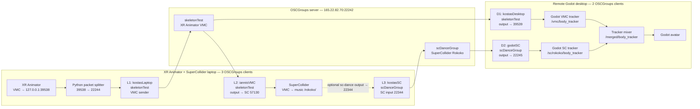

## XR-Aninator-to-Godot-and-SuperCollider
### General Instructions

#### SuperCollider to Godot OSCGroups Configuration
##### laptop sc-sender
`OscGroupClient.exe 165.22.82.70 22242 22346 22344 22345 kostasSC 12345 scDanceGroup test123`

##### desktop godot receiver
`OscGroupClient.exe 165.22.82.70 22242 22446 22444 22245 godotSC 12345 scDanceGroup test123`

##### XR-Animator to Godot OSCGroups Configuration
###### XR-Animator laptop sender
`OscGroupClient.exe 165.22.82.70 22242 22246 22244 22245 kostasLaptop 12345 skeletonTest test123`

###### desktop Godot receiver
`OscGroupClient.exe 165.22.82.70 22242 22246 22244 39539 kostasDesktop 12345 skeletonTest test123`

#### Ianis in SuperCollider
##### Receive from XR Animator /rokoko format data additional OSGroup Command
`OscGroupClient.exe 165.22.82.70 22242 22546 22544 57130 iannisVMC 12345 skeletonTest test123`

### For a 3 machine setup

##### XR Animator laptop — one command

`OscGroupClient.exe 165.22.82.70 22242 22246 22244 22245 kostasLaptop 12345 skeletonTest test123`

##### Iannis’s Mac — two commands
###### Terminal 1: receive XR Animator VMC
`./OscGroupClient 165.22.82.70 22242 22546 22544 57130 iannisVMC 12345 skeletonTest test123`

###### Terminal 2: send SuperCollider/sc-dance to Godot
`./OscGroupClient 165.22.82.70 22242 22346 22344 22345 iannisSC 12345 scDanceGroup test123`

##### Godot desktop — two commands

###### Command Prompt 1: receive XR Animator VMC

`OscGroupClient.exe 165.22.82.70 22242 22246 22244 39539 kostasDesktop 12345 skeletonTest test123`

###### Command Prompt 2: receive SuperCollider/sc-dance

`OscGroupClient.exe 165.22.82.70 22242 22446 22444 22245 godotSC 12345 scDanceGroup test123`

#### OSCGroups network architecture

